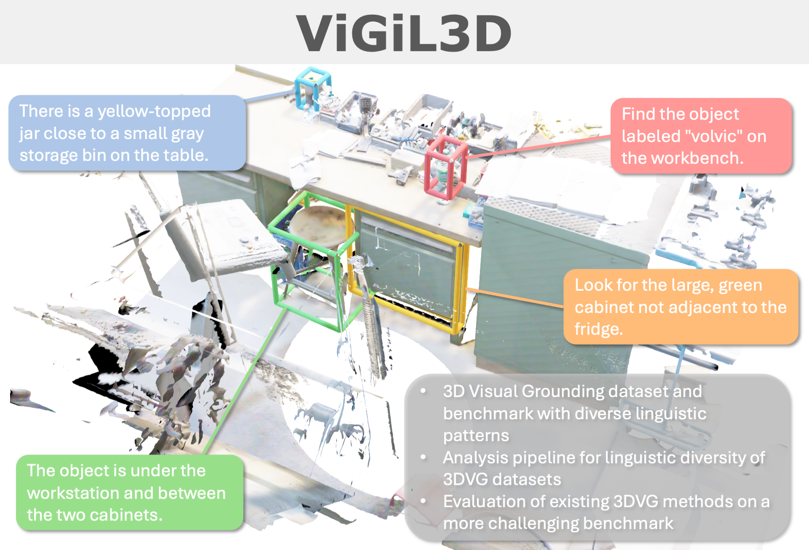

# ViGiL3D: A Linguistically Diverse Dataset for 3D Visual Grounding

[](https://arxiv.org/abs/2501.01366)
[](https://3dlg-hcvc.github.io/vigil3d)

[Austin T. Wang](https://atwang16.github.io)<sup>1</sup>, [ZeMing Gong](https://zmgong.github.io/)<sup>1</sup>, [Angel X. Chang](https://angelxuanchang.github.io/)<sup>1, 2</sup>

<sup>1</sup>Simon Fraser University, <sup>2</sup>Alberta Machine Intelligence Institute (Amii)



This repository contains the implementation for ViGiL3D, an evaluation dataset and benchmark for open-vocabulary visual grounding methods on 3D scenes with diverse linguistic patterns.

## Overview

3D visual grounding (3DVG) involves localizing entities in a 3D scene referred to by natural language text. Such models are useful for embodied AI and scene retrieval applications, which involve searching for objects or patterns using natural language descriptions. While recent works have focused on LLM-based scaling of 3DVG datasets, these datasets do not capture the full range of potential prompts which could be specified in the English language. To ensure that we are scaling up and testing against a useful and representative set of prompts, we propose a framework for linguistically analyzing 3DVG prompts and introduce **Visual Grounding with Diverse Language in 3D (ViGiL3D)**, a diagnostic dataset for evaluating visual grounding methods against a diverse set of language patterns. We evaluate existing open-vocabulary 3DVG methods to demonstrate that these methods are not yet proficient in understanding and identifying the targets of more challenging, out-of-distribution prompts, toward real-world applications.

## Setup

### Requirements

The current repository, and all inference results, have been generated and tested with
* Python 3.11
* CUDA 12.1

### Install

Install the base package by running
```bash
./setup/install_cu121.sh
```

It is recommended to activate a virtual environment (e.g. `pyenv`) first before running the script.

Note that the original `MinkowskiEngine` package is hosted by [NVIDIA](https://github.com/NVIDIA/MinkowskiEngine), but 
there is an incompatibility with CUDA 12.1 in the original package that has been patched in the fork installed in the
shell script.

### Environment

Create a file called `.env` with the following contents:

```
LOG_LEVEL="WARNING"
NEPTUNE_API_TOKEN="<key>"
OPENAI_API_KEY="<key>"
```

The OpenAI key is required for dataset analysis, and the neptune API token is required for experiment tracking and logging. To disable Neptune, run

```shell
neptune sync --offline-only
```

### Data

The datasets analyzed can be found at the respective locations. Please be sure to read and agree to the licensing and usage agreements of the respective datasets:
* [ScanRefer](https://daveredrum.github.io/ScanRefer/)
* [Nr3D/Sr3D+](https://referit3d.github.io)
* [Multi3DRefer](https://3dlg-hcvc.github.io/multi3drefer/#/)
* [3D-GRAND](https://3d-grand.github.io)
* [ScanScribe](3d-vista.github.io/)
* [SceneVerse](https://scene-verse.github.io)
* [Instruct3D](https://heshuting555.github.io/SegPoint/)

The prompts for ViGiL3D can be found in the [data](data/) folder.

### Dataset Preparation

To prepare any of the external datasets for **analysis**, use the analysis scripts in `ovfgvg/scripts/utilities`. The output
format should be a JSON with the following format, saved to `.data/datasets/<dataset_name>/<split>/metadata.json`:

```json
{
    "grounding": [
        {
            "id": "prompt_id",
            "scene_id": "scene_id",
            "text": "grounding_description",
            "entities": [
                {
                    "is_target": true,
                    "ids": ["object_ids"],
                    "target_name": "label",
                    "labels": ["label"],
                    "indexes": null,
                    "boxes": [
                        {
                            "center": ["x", "y", "z"],
                            "half_dims": ["x", "y", "z"],
                            "rotation": ["w", "x", "y", "z"]
                        }
                    ],
                    "mask": null
                }
            ],
            "metadata": {},
            "mask": null
        }
    ]
}
```

To prepare the ViGiL3D dataset for **evaluation**, use the preprocessing tool:

```shell
# ScanNet
preprocess name=preprocess-vigil3d-scannet data=vigil3d_scannet

# ScanNet++
preprocess name=preprocess-vigil3d-scannetpp data=vigil3d_scannetpp
```

To support additional datasets, you will need to add a data config to `config/data` and a script to `ovfgvg/data/preprocessing` to process the data. The preprocessed dataset form is
a folder containing one subfolder for each split, where each split folder contains a single file per scene:
```
<dataset_folder>
├── train
│   ├── metadata.json
│   ├── <scene_id>.pth
│   ├── ...
├── val
│   ├── metadata.json
│   ├── <scene_id>.pth
│   ├── ...
├── test
│   ├── metadata.json
│   ├── <scene_id>.pth
│   ├── ...
```
Naming conventions can largely be customized in the configurations, to avoid harcoding any of the specific paths above.

Each scene file stores a dictionary which can be restored into an `ovfgvg.data.types.Scene` object using 
`Scene.from_dict`.

## Usage

### Dataset Analysis

To generate analysis metrics for a dataset, run the below script using the corresponding dataset name.

```bash
DATASET="vigil3d_scannet"
analyze name=analyze-${DATASET} data=${DATASET} split=test num_prompts=1000
```

### Evaluation

\[August 8, 2025\] For an easier and more direct way to evaluate your model on ViGiL3D, refer to [EVALUATION.md](EVALUATION.md) for further documentation.

To evaluate a given model, you will need to generate predictions in the following form:

```json
[
  {
    "prompt_id": "ID of prompt",
    "scene_id": "ID of scene",
    "prompt": "Description of scene",
    "predicted_boxes": [
      [
        [
            "centroid_x",
            "centroid_y",
            "centroid_z"
        ],
        [
            "extent_x",
            "extent_y",
            "extent_z"
        ]
      ]
    ]
  }
]
```

To run an evaluation job, run
```bash
METHOD_NAME="openscene"
DATASET="vigil3d_scannet"  # or vigil3d_scannetpp
PREDICTIONS="path/to/predictions.json"

evaluate name=evaluate-${METHOD_NAME}-vigil3d-scannet-gt data=${DATASET} model=predictions predictions=${PREDICTIONS}
```

## Credits

Credit for some of the implementations in this repository come from the following prior works:
* [ScanNet](https://github.com/ScanNet/ScanNet)
* [ScanRefer](https://github.com/daveredrum/ScanRefer)
* [OpenScene](https://github.com/pengsongyou/openscene)
* [LERF](https://github.com/kerrj/lerf)
* [PointBERT](https://github.com/lulutang0608/Point-BERT)
* [Grounding DINO](https://github.com/IDEA-Research/GroundingDINO)
* [Mask3D](https://github.com/JonasSchult/Mask3D)

If you use the ViGiL3D data or code, please cite:
```
@article{wang2024vigil3d,
  author={Wang, Austin T. and Gong, ZeMing and Chang, Angel X.},
  title={{ViGiL3D}: A Linguistically Diverse Dataset for 3D Visual Grounding},
  journal={arXiv preprint},
  year={2024},
  eprint={2501.01366},
  archivePrefix={arXiv},
  primaryClass={cs.CV},
  doi={10.48550/arxiv.2501.01366},
}
```