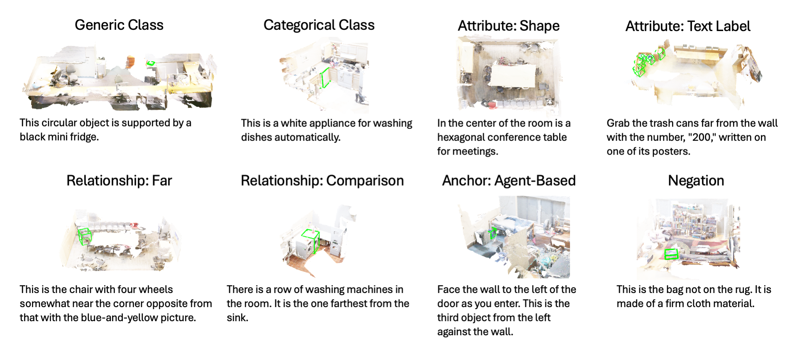

# ViGiL3D Dataset

Please find the text descriptions and metadata for each visual grounding prompt here. The scene data can be found at
the original sources:

* [ScanNet](http://www.scan-net.org/)
* [ScanNet++](https://kaldir.vc.in.tum.de/scannetpp/)

## Format

The following files can be found here:
* `vigil3d_scannet.csv` - visual grounding descriptions for selected ScanNet scenes
* `vigil3d_scannetpp.csv` - visual grounding descriptions for selected ScanNet++ scenes

Each CSV includes the following fields:
* `prompt_id` - ID of prompt (ideally, should be unique across scene datasets)
* `scene_id` - ID of scene
* `object_id` - IDs of target objects (as specified in ground truth object mapping)
* `object_name` - text label of object category, if applicable
* `description` - natural language description of target object
* `pair_id` - integer ID representing pairs of descriptions which were designed to be similar
* `is_valid` - 1 if a valid prompt, else 0 if it should be ignored

Additional fields (most prefixed as `num_`) include manual metadata characterizing the linguistic patterns of each prompt.
These include
* `num_attributes_target` - number of attributes used to describe target object(s)
* `num_attributes_anchors` - number of attributes used to describe anchor objects
* `num_attribute_type_*` - captures use of different attribute types (e.g. color, size, material)
* `num_relationships_target` - number of relationships used to compare target objects with other objects
* `num_relationships_anchors` - number of relationships used to compare anchor objects to one another
* `num_relationship_type_*` - captures use of different relationship types (e.g. near, far, vertical)
* `num_coreferences` - 1 if coreferences are used
* `num_target_not_first_np` - 1 if target is first noun phrase (NP) in prompt
* `granularity` - captures specificity of target object reference (e.g. generic, coarse-grained, fine-grained)
* `num_anchor_type_*` - captures use of different types of anchors (e.g. single, multiple, viewpoint, agent)
* `num_negation` - 1 if negation was used in prompt, else 0
